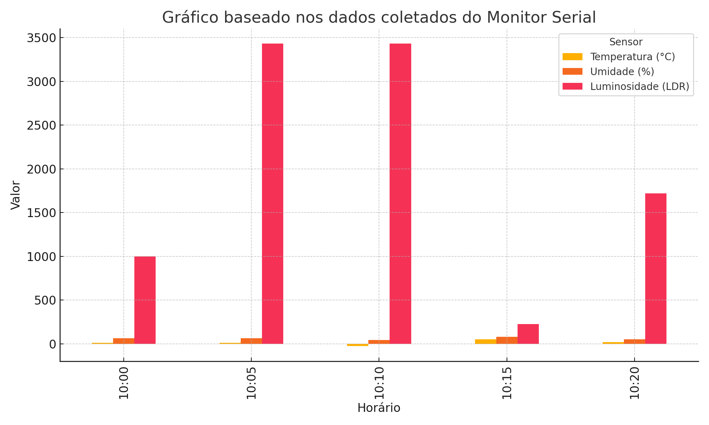

# Enterprise-Challenge-Sprint2-Reply

## 👥 Integrantes do Grupo
- Ricardo de Paiva Melo: RM 565522
- Artur de Carvalho: RM 558646
- Caíque de Souza maulen: RM 560700
- Luiz Felipe Alves Gomes: RM 565151
- Nicolas Lemos Ribeiro: RM 553273

---

## 🎯 Objetivo

Simular um sistema de coleta de dados para ambientes industriais utilizando ESP32 e sensores DHT22 (temperatura/umidade) e LDR (luminosidade) na plataforma Wokwi. O sistema realiza a leitura dos sensores e imprime os dados via Monitor Serial, permitindo a análise posterior em formato gráfico.

---

## 🧰 Sensores Utilizados

- **DHT22**: sensor digital de temperatura e umidade. Escolhido por fornecer duas variáveis críticas com precisão.
- **LDR**: sensor analógico que mede a intensidade luminosa, comum em sistemas industriais que precisam monitorar luz ambiente.

---

## 🔌 Circuito Simulado

- A montagem foi realizada na plataforma Wokwi:  
  🔗 [Acesse a simulação no Wokwi](https://wokwi.com/projects/432931353855285249)

- Imagem do circuito:  
  

---

## 💻 Código-Fonte

- Código do ESP32: [`codigo/codigoESP32.ino`](codigo/codigoESP32)
- Script Python para gerar o gráfico: [`scripts/codigoGraficoPython.py`](codigo/codigoGraficoPython)

---

## 🧪 Coleta de Dados

Os dados foram capturados via **Monitor Serial** da simulação. Exemplo de leitura:

Temperatura: 21.40 °C | Umidade: 52.00 % | Luminosidade (LDR): 1718

- CSV com as leituras: [`dados/dados_monitor_serial.csv`](dados/dados_monitor_serial.csv)

---

## 📈 Análise Gráfica

A partir dos dados, foi gerado um gráfico de barras para análise visual das medições feitas ao longo do tempo.

- Gráfico gerado:  
  

---

## ✅ Conclusão

O projeto simula um ambiente de coleta de dados em tempo real utilizando sensores integrados ao ESP32. A experiência reforça o entendimento de sistemas embarcados e sua aplicação na Indústria 4.0, com base em sensoriamento e análise de dados.
